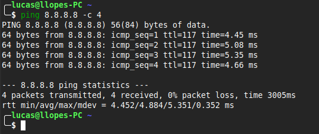
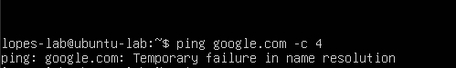
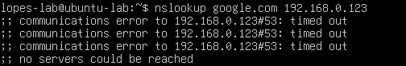

# DNS Failure — Análise e Troubleshooting

## Problema
Simulação de falha na resolução de nomes DNS para identificar a diferença entre
falha de conectividade e falha de resolução de nomes.

## Ambiente
- Host: Linux Mint
- VM: Ubuntu Server 24.04 LTS (VirtualBox)
- Ferramentas: ping, nslookup

## Investigação

### 1. Validação da conectividade (camada 3)
Ping direto por IP para confirmar que a rede estava funcionando:

### 2. Quebra do DNS
Alterado o arquivo `/etc/resolv.conf` na VM com um servidor DNS inexistente:
nameserver 192.168.0.123

### 3. Teste de resolução por nome
Ping por nome falhou com "Temporary failure in name resolution":

### 4. Teste direto no servidor DNS falso
nslookup google.com 192.168.0.123

## Solução
Revertido o `/etc/resolv.conf` para o servidor DNS original (`127.0.0.53`
— systemd-resolved padrão do Ubuntu).

## Resultado
Conectividade restabelecida. Ping por nome voltou a funcionar normalmente.

## Análise de segurança
- Camada 3 funcionando não significa que o usuário consegue acessar a internet
- Falha de DNS pode ser erro de configuração ou ataque de envenenamento de DNS (DNS spoofing)
- Impacto real: usuário interpreta como "internet caiu" quando é só resolução de nomes
- Monitorar alterações no `/etc/resolv.conf` é uma prática importante em ambientes corporativos
