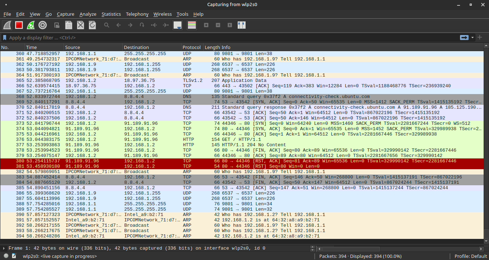
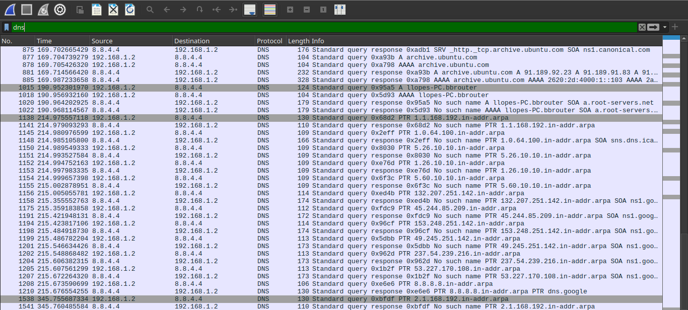
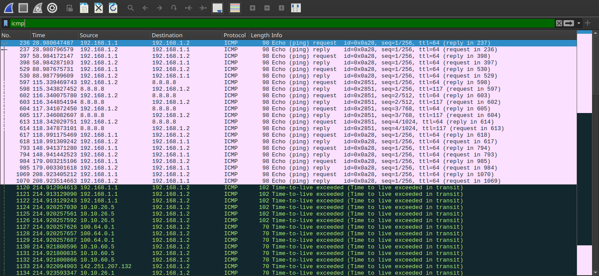

# Traffic Analysis — Análise de Tráfego com Wireshark

## Problema
Captura e análise de tráfego de rede para identificar padrões,
protocolos e comportamentos que servem de base para detecção de anomalias.

## Ambiente
- Host: Linux Mint
- Ferramenta: Wireshark 4.2.2
- Interface capturada: wlp2s0 (Wi-Fi)

## Investigação

### 1. Início da captura
Wireshark iniciado na interface wlp2s0 com captura ativa:

### 2. Geração de tráfego
Tráfego gerado para análise:
ping google.com -c 4
nslookup github.com
traceroute google.com

### 3. Filtro DNS
Filtro aplicado para isolar consultas e respostas DNS:

### 4. Filtro ICMP
Filtro aplicado para isolar pacotes ICMP do ping:

## Solução
Captura salva em `evidencias/capturas/captura-lab.pcapng` para análise posterior.

## Resultado
Tráfego DNS e ICMP identificado e isolado com sucesso via filtros do Wireshark.

## Análise de segurança
- DNS trafega em texto claro: qualquer host na rede consegue ver quais domínios foram consultados
- Análise de tráfego é a base de qualquer investigação de segurança ou forense de rede
- Filtros permitem isolar protocolos e identificar anomalias no meio de grande volume de pacotes
- Em ambiente corporativo: monitoramento contínuo de tráfego DNS pode revelar exfiltração de dados ou C2
