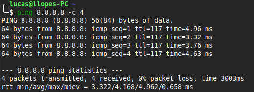
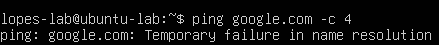
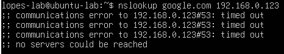

# DNS Failure — Análise e Troubleshooting

## Problema
Simulação de falha na resolução de nomes DNS para identificar a diferença entre
falha de conectividade e falha de resolução de nomes.

## Ambiente
- Host: Linux Mint
- VM: Ubuntu Server 24.04 LTS (VirtualBox)
- Ferramentas: ping, nslookup

## Investigação

### 1. Validação da conectividade (camada 3)
Ping direto por IP para confirmar que a rede estava funcionando:

### 2. Quebra do DNS
Alterado o arquivo `/etc/resolv.conf` na VM com um servidor DNS inexistente:
nameserver 192.168.0.123

### 3. Teste de resolução por nome
Ping por nome falhou com "Temporary failure in name resolution":

### 4. Teste direto no servidor DNS falso
nslookup google.com 192.168.0.123

## Solução
Revertido o `/etc/resolv.conf` para o servidor DNS original (`127.0.0.53`
— systemd-resolved padrão do Ubuntu).

## Resultado
Conectividade restabelecida. Ping por nome voltou a funcionar normalmente.

## Análise de segurança

### 1. Indisponibilidade vs. Integridade
*   **DNS Failure (Cenário Simulado):** O erro "Temporary failure in name resolution" indica uma quebra de **disponibilidade**. O serviço de nomes para de responder, resultando em um erro explícito. É o sintoma comum de falhas de configuração ou ataques de **DoS/DDoS** contra o resolver DNS.
*   **DNS Spoofing (Risco Associado):** Diferente da falha simulada, ataques de envenenamento de cache (Poisoning) ou Spoofing atacam a **integridade**. O comando `nslookup` retornaria um IP com sucesso, porém pertencente a um atacante, direcionando o usuário para sites falsos sem que mensagens de erro apareçam.

### 2. Visibilidade e Camadas OSI
A análise reforça a importância do troubleshooting em camadas. O `ping` por IP (Camada 3) confirmou que o "túnel" de comunicação estava aberto, isolando o problema para a **Camada 7 (Aplicação)**, onde o protocolo DNS opera.

### 3. Vetores de Ataque e Mitigação
*   **Intercepção:** Como o tráfego DNS padrão (porta 53 UDP) viaja sem criptografia, ele é vulnerável a ataques de *Man-in-the-Middle* (MitM).
*   **Boas Práticas:** 
    *   Implementação de **DNSSEC** para garantir a autenticidade das respostas.
    *   Uso de **DoH (DNS over HTTPS)** para criptografar as consultas.
    *   Monitoramento constante de alterações em arquivos críticos como `/etc/resolv.conf` e configurações de Netplan.
