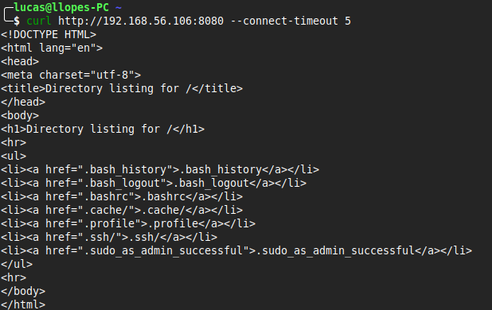
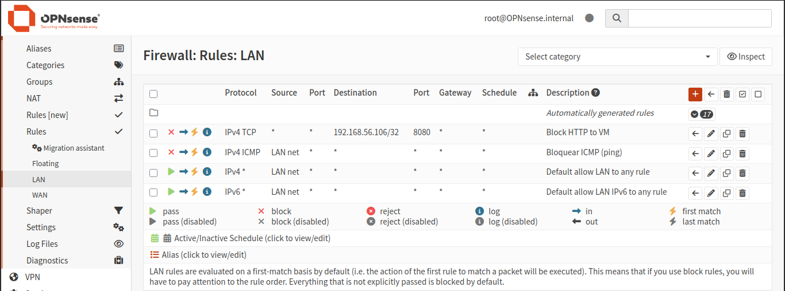
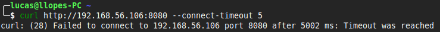

# Firewall Control — Controle de Acesso

## Problema
Demonstração de controle de acesso a serviços expostos na rede,
aplicando o princípio do menor privilégio.

## Ambiente
- Host: Linux Mint
- Virtualização: VirtualBox
- VM 1: Ubuntu Server 24.04 LTS (serviço + UFW)
- VM 2: OPNsense (firewall de rede)
- Ferramentas: python3, curl, ufw, OPNsense

## Investigação

### 1. Serviço exposto sem controle de acesso
Servidor HTTP subido na VM na porta 8080:

python3 -m http.server 8080


Acesso confirmado pelo host:



---

### 2. Aplicação da regra de bloqueio
Após identificar a exposição do serviço, o bloqueio da porta 8080 foi implementado em duas camadas de segurança:

- Firewall local na VM Ubuntu Server utilizando UFW  
- Firewall de rede na VM OPNsense

Essa abordagem segue o conceito de defense in depth (defesa em profundidade).

### Firewall local (UFW)

Ativação do firewall e criação da regra de bloqueio na VM Ubuntu Server:

```bash
sudo ufw enable
sudo ufw deny 8080
sudo ufw status numbered
```
### Firewall de rede (OPNsense)

Regra aplicada no OPNsense, bloqueando o tráfego para a porta 8080 da VM:



---

### 3. Teste após bloqueio
Tentativa de acesso bloqueada com timeout:



---

## Solução
Porta 8080 bloqueada em múltiplas camadas (UFW na VM e OPNsense na rede), tornando o serviço inacessível externamente.

## Resultado
Antes: serviço acessível por qualquer host na rede.
Depois: conexão recusada, timeout imediato.

## Análise de segurança
- Serviço exposto sem controle = superfície de ataque desnecessária
- Controle em múltiplas camadas, reduzindo risco mesmo em caso de falha de uma das proteções
- UFW como controle local (host-based firewall)
- OPNsense como controle de perímetro (network firewall)
- Princípio do menor privilégio aplicado na camada de rede


