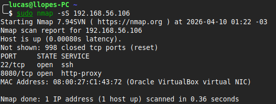
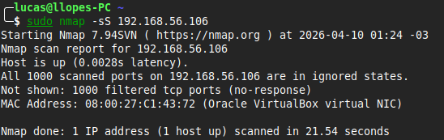

# Port Scan — Reconhecimento com Nmap

## Problema
Simulação de varredura de portas para identificar serviços expostos
e demonstrar o impacto do firewall na superfície de ataque.

## Ambiente
- Host: Linux Mint
- VM: Ubuntu Server 24.04 LTS (VirtualBox)
- Ferramentas: Nmap 7.94, ufw

## Investigação

### 1. Scan antes do firewall
Varredura SYN scan com ufw desabilitado:
```bash
sudo nmap -sS 192.168.56.106
```
Portas abertas identificadas:



Resultado:
- 22/tcp — SSH
- 8080/tcp — HTTP

### 2. Ativação do firewall
ufw habilitado na VM:
```bash
sudo ufw enable
```
> ***Nota:** Em acesso remoto, utilize `ufw allow 22` antes de ativar o firewall para evitar o bloqueio do SSH.*

### 3. Scan depois do firewall
Repeti a mesma varredura após a ativação das regras de bloqueio:
```bash
sudo nmap -sS 192.168.56.106
```



Resultado: O Nmap reportou 1000 portas como `filtered`, indicando que os pacotes foram descartados sem resposta pelo firewall.

### Comparativo de Exposição

### Conclusão e Resultados

| Estado | Portas Visíveis | Risco de Exposição |
| :--- | :--- | :--- |
| **Sem Firewall** | 22/TCP, 8080/TCP | Alto (Serviços expostos a ataques) |
| **Com Firewall** | Nenhuma (1000 filtered) | Baixo (Superfície de ataque reduzida) |

## Solução
Firewall ativo bloqueando todo tráfego não autorizado.

## Resultado
Antes: 2 portas abertas e visíveis (SSH e HTTP).
Depois: 1000 portas filtered - superfície de ataque drasticamente reduzida.

## Análise de segurança
*   **Redução da Superfície de Ataque:** Cada porta aberta e serviço exposto representa um vetor potencial de exploração. O firewall atua como a primeira camada da **Defesa em Profundidade**, garantindo que apenas serviços estritamente necessários sejam acessíveis externamente.
*   **Visão do Atacante (Reconnaissance):** O Nmap é a ferramenta padrão na fase de reconhecimento de um ataque. Ao realizar varreduras próprias, o defensor antecipa o que um atacante veria, permitindo a correção proativa de exposições acidentais.
*   **Comportamento do Firewall (Filtered vs. Closed):** 
    *   **Filtered:** Indica que o firewall aplicou uma política de *DROP* (descarte silencioso). Para o atacante, isso aumenta a incerteza e o tempo de varredura, pois o scanner fica aguardando um timeout.
    *   **Closed:** Indica que o host respondeu com um pacote *RST* (reset). Isso confirma que o host está ativo e que não há um firewall bloqueando aquela porta específica, facilitando o mapeamento da rede.
*   **Gestão de Vulnerabilidades:** Em ambientes corporativos, a execução de scans periódicos é uma prática de conformidade essencial. Ela ajuda a detectar "Shadow IT" (serviços instalados por usuários sem autorização) e falhas de configuração em regras de firewall.
