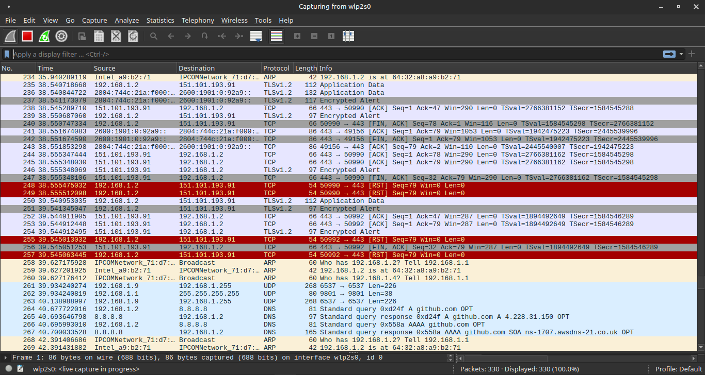
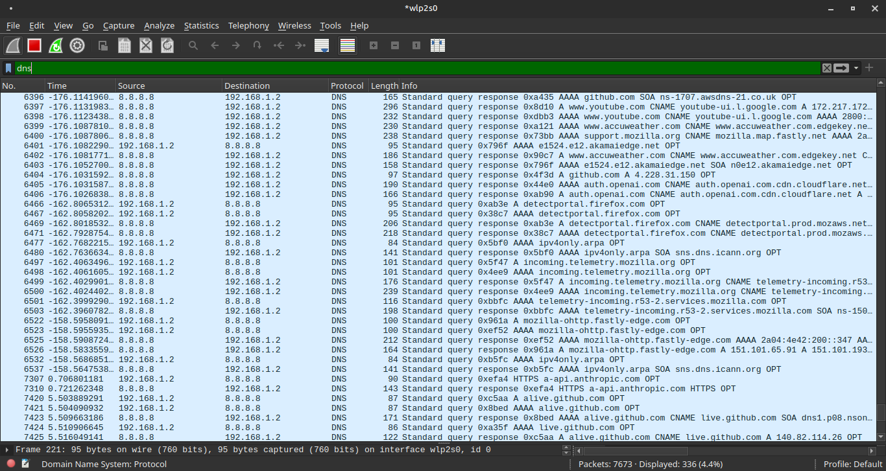
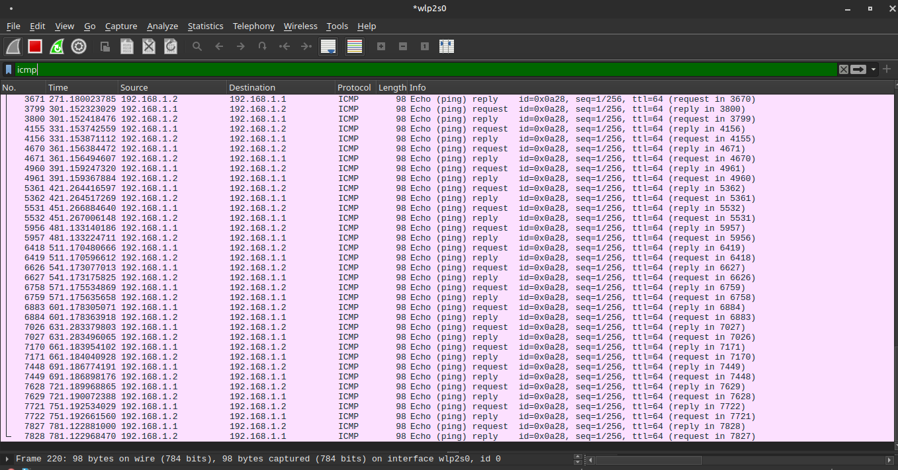

# Traffic Analysis — Análise de Tráfego com Wireshark

## Problema
Captura e análise de tráfego de rede para identificar padrões,
protocolos e comportamentos que servem de base para detecção de anomalias.

## Ambiente
- Host: Linux Mint
- Ferramenta: Wireshark 4.2.2
- Interface capturada: wlp2s0 (Wi-Fi)

## Investigação

### 1. Início da captura
Wireshark iniciado na interface wlp2s0 com captura ativa:

### 2. Geração de tráfego
Tráfego gerado para análise:
ping google.com -c 4
nslookup github.com

### 3. Filtro DNS
Apliquei o filtro `dns` para isolar as requisições de resolução de nomes.
- **Análise:** Foi possível observar o tráfego saindo da VM em direção ao resolver, utilizando o protocolo **UDP na porta 53**. Notei a estrutura de *Standard Query* e a respectiva resposta com o endereço IP do domínio consultado.

### 4. Filtro ICMP
Filtrei o tráfego pelo protocolo `icmp` para validar o teste de conectividade.
- **Análise:** A captura revelou o ciclo de vida do comando ping, exibindo pacotes do tipo **Echo (ping) request** seguidos pelos pacotes de **Echo (ping) reply**, confirmando a comunicação bidirecional.

## Solução
Captura salva em `evidencias/capturas/captura-lab.pcapng` para análise posterior.

## Resultado
Tráfego DNS e ICMP identificado e isolado com sucesso via filtros do Wireshark.

## Análise de segurança
* **Vulnerabilidade do DNS em Texto Claro:** A captura confirmou que consultas DNS padrão não possuem criptografia. Um atacante realizando *sniffing* na rede pode mapear o comportamento do usuário e os serviços utilizados. 
* **Detecção de Ameaças:** A análise de tráfego é fundamental para identificar **DNS Tunneling** (uso do protocolo DNS para retirar dados de uma rede de forma camuflada) e comunicações de **C2 (Command & Control)**.
* **Protocolos ICMP:** Embora úteis para diagnóstico, pacotes ICMP podem ser explorados para mapeamento de rede (*host discovery*) por atacantes. Em ambientes de alta segurança, é comum limitar o tipo de mensagens ICMP permitidas.
* **Forense de Rede:** O arquivo `.pcapng` gerado serve como evidência imutável em um processo de resposta a incidentes, permitindo reconstruir exatamente o que aconteceu durante um evento suspeito.
