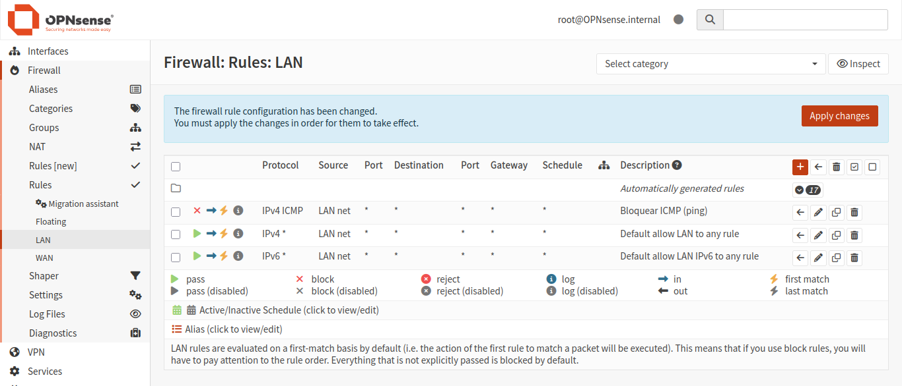
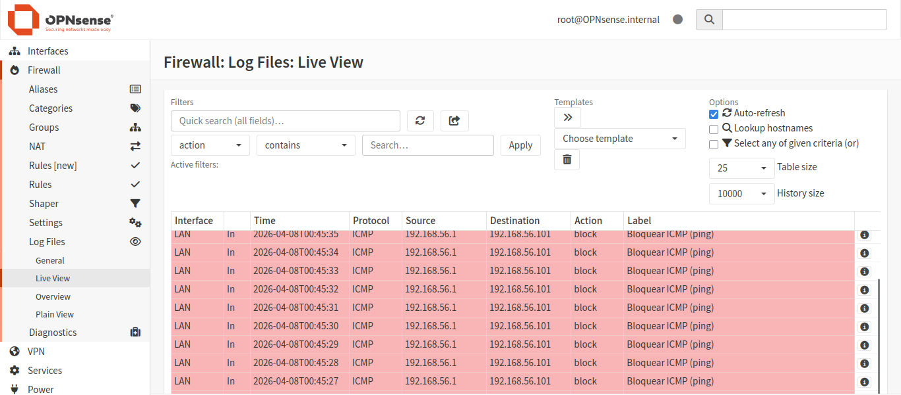
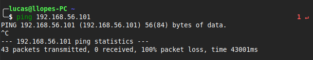

# Nível 2 — Regras de Firewall

## Objetivo
Criar regras de controle de tráfego no OPNsense, entendendo
como o firewall decide o que bloquear e o que permitir.

## Regras criadas
- Block ICMP (ping) — bloqueia pacotes ICMP saindo da LAN

## Prints

**Regras da interface LAN:**

**Log bloqueando ICMP:**

**Teste de ping bloqueado:**

## O que eu aprendi
Consolidei o conceito de First Match: as regras são processadas de forma sequencial (top-down) e a primeira correspondência interrompe a análise.

Além disso, compreendi a aplicação de regras em interfaces específicas. Como o lab ainda não possui máquinas clientes, utilizei as ferramentas de Packet Capture e Live View Logs do próprio OPNsense para validar o bloqueio do tráfego originado na interface LAN. Isso reforçou a importância de saber ler logs para auditoria e troubleshooting de políticas de segurança.

---

## 👤 Autor: Lucas Lopes

Feito com 💙 e ☕ como parte do meu Home Lab e estudos hands-on.
