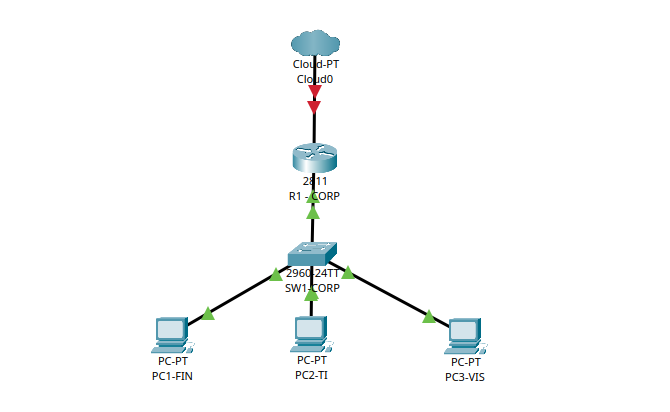
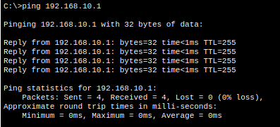

# 🧪 Simulação de Rede – Home Lab

> Projeto de simulação de ambiente corporativo com segmentação por VLANs, roteamento inter-VLAN (Router-on-a-Stick) e validação de conectividade, utilizando **Cisco Packet Tracer**.

---

## 📋 Índice

- [Topologia](#1️⃣-topologia)
- [Configuração do Switch](#2️⃣-configuração-do-switch)
- [Configuração do Router](#3️⃣-configuração-do-router-router-on-a-stick)
- [Configuração dos PCs](#4️⃣-configuração-dos-pcs)
- [Teste de Conectividade](#5️⃣-teste-de-conectividade)

---

## 1️⃣ Topologia

| Componente | Detalhe |
|-----------|---------|
| 🔀 Switch | Cisco 2960-24TT |
| 🌐 Router | 1x Router (Fa0/0 como trunk) |
| 💻 PCs | 3 PCs em portas de acesso |
| 🔗 Trunk | Fa0/24 (switch) → Fa0/0 (router) |

### VLANs configuradas

| VLAN | Nome | Segmento |
|------|------|----------|
| 10 | FINANCEIRO | 192.168.10.0/24 |
| 20 | TI | 192.168.20.0/24 |
| 30 | VISITANTE | 192.168.30.0/24 |

📸 *Topologia completa*


---

## 2️⃣ Configuração do Switch

### Criação das VLANs

```cisco
Switch> enable
Switch# conf t

Switch(config)# vlan 10
Switch(config-vlan)# name FINANCEIRO
Switch(config-vlan)# vlan 20
Switch(config-vlan)# name TI
Switch(config-vlan)# vlan 30
Switch(config-vlan)# name VISITANTE
Switch(config-vlan)# exit
```

### Portas de acesso dos PCs

```cisco
Switch(config)# interface fa0/1
Switch(config-if)# switchport mode access
Switch(config-if)# switchport access vlan 10

Switch(config)# interface fa0/2
Switch(config-if)# switchport mode access
Switch(config-if)# switchport access vlan 20

Switch(config)# interface fa0/3
Switch(config-if)# switchport mode access
Switch(config-if)# switchport access vlan 30
```

### Porta trunk para o Router

```cisco
Switch(config)# interface fa0/24
Switch(config-if)# switchport mode trunk
Switch(config-if)# switchport trunk allowed vlan 10,20,30
```

📸 *VLANs configuradas no switch*


---

## 3️⃣ Configuração do Router (Router-on-a-Stick)

```cisco
Router> enable
Router# conf t

! Subinterface – VLAN 10 (FINANCEIRO)
Router(config)# interface fa0/0.10
Router(config-subif)# encapsulation dot1Q 10
Router(config-subif)# ip address 192.168.10.1 255.255.255.0
Router(config-subif)# no shutdown

! Subinterface – VLAN 20 (TI)
Router(config)# interface fa0/0.20
Router(config-subif)# encapsulation dot1Q 20
Router(config-subif)# ip address 192.168.20.1 255.255.255.0
Router(config-subif)# no shutdown

! Subinterface – VLAN 30 (VISITANTE)
Router(config)# interface fa0/0.30
Router(config-subif)# encapsulation dot1Q 30
Router(config-subif)# ip address 192.168.30.1 255.255.255.0
Router(config-subif)# no shutdown
```

📸 *Subinterfaces configuradas no router*


---

## 4️⃣ Configuração dos PCs

| PC | VLAN | Endereço IP | Máscara | Gateway |
|----|------|-------------|---------|---------|
| PC1-FIN | 10 | 192.168.10.10 | 255.255.255.0 | 192.168.10.1 |
| PC2-TI | 20 | 192.168.20.10 | 255.255.255.0 | 192.168.20.1 |
| PC3-VIS | 30 | 192.168.30.10 | 255.255.255.0 | 192.168.30.1 |

📸 *Configuração de IP nos desktops*


---

## 5️⃣ Teste de Conectividade

| Origem | Destino | Resultado |
|--------|---------|-----------|
| PC1-FIN | Gateway 192.168.10.1 | ✅ Sucesso |
| PC2-TI | Gateway 192.168.20.1 | ✅ Sucesso |
| PC3-VIS | Gateway 192.168.30.1 | ✅ Sucesso |

📸 *Ping funcionando*


---

## 🛠️ Tecnologias utilizadas


---

## 👤 Autor

Feito com 💙 como parte do meu Home Lab de estudos em redes.
